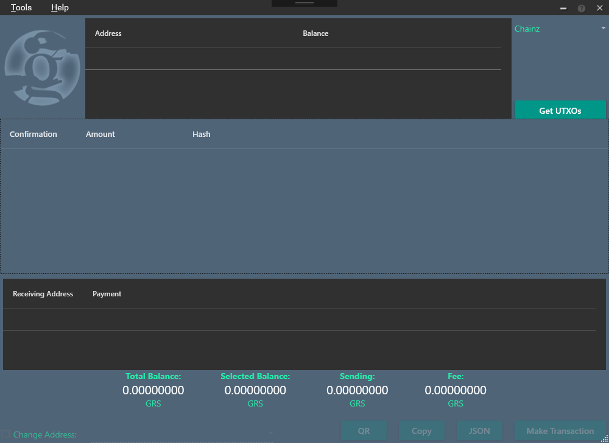

# Groestlcoin Transaction Tool
**Language:** C#

**Packages needed:** 
- Newtonsoft.Json
- QRCoder

This is a tool for creating unsigned raw Groestlcoin transactions and also to verify existing transactions by entering in the transaction hex and converting this to a human-readable format to verify that a transaction is correct before it is signed.

## Features:
1.    Create Raw Unsigned Groestlcoin transactions
2.    Coin Control
3.    Generates a QR code for the transaction
4.    Verifying Transactions
5.    Compatible with most Groestlcoin wallets including but not restricted to Groestlcoin Core and Electrum-GRS
6.    Estimates final signed transaction size
7.    Taking a raw transaction format and shows its Transaction ID, Transaction Inputs and Outputs

###Don't forget to leave your feedback, Thank you.
**Wanna help?** 

Then review the code and leave your feedback.

